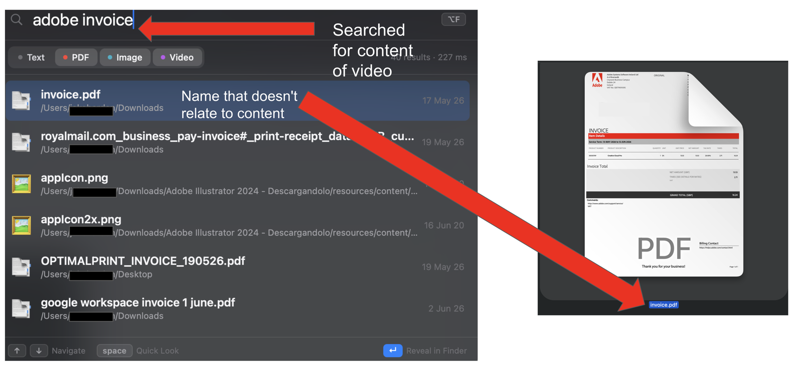
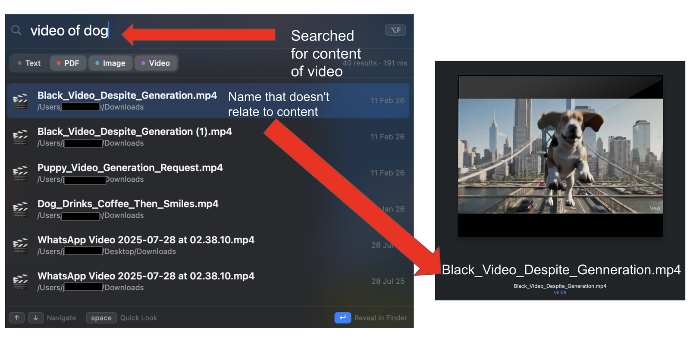

<p align="center">
  
</p>

<p align="center">
  <a href="https://github.com/jcooksh/turbofind/releases/latest/download/TurboFind.dmg">
    
  </a>
</p>

<p align="center"><sub>First open: <b>right-click the app → Open</b> (it's self-signed, not
notarized). First launch sets up the engine — a few minutes, needs internet.</sub></p>

<p align="center"><sub>No-fuss alternative: <code>brew install --cask jcooksh/tap/turbofind</code></sub></p>

# TurboFind

A private, blazing-fast, **fully local** semantic file explorer for macOS.
Search your files — text, PDFs, images, video — by *meaning*, not filename.
Nothing leaves your machine.

## See it

Search by what's *inside* a file, even when the filename gives nothing away:

**PDFs** — "adobe invoice" finds the actual invoice, named only `invoice.pdf`:



**Video** — "video of dog" finds the clip whose name is `Black_Video_Despite_Generation.mp4`:



## ⚡ Quick start

### Homebrew (easiest)

```bash
brew install --cask jcooksh/tap/turbofind
```

Builds from source on install (TurboFind drives a local Python + ML engine in
`~/turbofind`), so the first run takes a few minutes to set up. After that the
in-app **Update** button keeps it current. One-time: grant **Full Disk Access**
to `~/turbofind/menubar/TurboFind.app` (System Settings → Privacy & Security).

### From source

```bash
git clone https://github.com/jcooksh/turbofind && cd turbofind
python3 -m venv .venv && source .venv/bin/activate
pip install -U pip                     # old pip can choke on wheels
pip install -r requirements.txt        # first run downloads the models (~once)

# index your files — text, PDFs, images & video. ~ = your whole home (junk
# dirs like node_modules/Library are auto-skipped). First run takes a few
# minutes; the progress bar shows an ETA. MULTI_MODAL=1 turns on media the
# first time; after that it's automatic.
TURBOFIND_MULTI_MODAL=1 python ingest.py --once ~

cd menubar && ./build.sh && open TurboFind.app   # the native menu-bar app
```

That's it. Click the bolt in the menu bar (or press **⌥F** anywhere), type, and
hit **Enter** to reveal a file in Finder. The app runs the search engine for you
in the background and auto-indexes new files. Prefer the terminal?
`python search.py "my tax documents"`.

- Point it at a smaller folder to start if you like — but **not an empty one**:
  semantic search needs a real corpus (a near-empty `~/Documents`, common with
  iCloud, just returns the same few results every query).
- New files later index themselves: `serve.py` (and the menu-bar app) watches
  your home and auto-indexes new/changed/deleted files while it runs — no
  re-run needed. Each result shows when the file was added to your Mac.
- **Video** needs the ffmpeg binary: `brew install ffmpeg`.

> macOS · Apple Silicon. First run pulls the embedding models from HuggingFace
> (one time); everything after is offline. Set `TURBOFIND_OFFLINE=1` to force it.

## Architecture

| File | Role |
|------|------|
| `shared.py` | Config + modality toggle, paths, id hashing, the `id -> path` sidecar, the modality-aware embedder (shared singleton), and turbovec helpers. |
| `ingest.py` | Background `watchdog` daemon — keeps the index in sync (create/modify/delete/move), media pipeline, low-priority initial scan. |
| `search.py` | Instant CLI — **hybrid** (semantic + lexical) ranking; prints / `--json` top-k. |
| `serve.py` | The engine the app drives: a warm loopback **JSON API** (`/search`, `/reveal`, `/preview`) with the model loaded once. Also **live-indexes** the watched tree in-process (new/changed/deleted files), so the index never goes stale while it runs. No browser UI — the front end is the native app. Loopback-only + Host-guarded; no CORS. |
| `spotlight.py` | Best-effort bridge mirroring indexed items into native macOS CoreSpotlight. |
| `Launcher.swift` | Spotlight/Raycast-style floating search bar (Option+Space) that drives the backend and reveals files in Finder. |

## Hybrid scoring

`final = 0.7 · semantic + 0.3 · lexical`, where `semantic` is cosine mapped to
[0,1] and `lexical = max(BM25-over-candidate-pool, filename/path word-overlap)`.
Any file whose **name** contains a query *word* (whole-token, not substring) is
forced to a hard top tier — even if its content embedding falls outside the
dense top-50, name matches are unioned back in (an O(N) mapping scan per query;
a persistent name-token index is the fix for very large corpora). This kills the
"exam timetable → taxes file" semantic drift.

## The app

A **native** macOS menu-bar app — no browser, no localhost, no WebView. The
whole UI (search box + results) is AppKit:

```bash
cd menubar && ./build.sh && open TurboFind.app
```

Click the bolt in the menu bar (or press **⌥F** anywhere) → a popover drops down
with the cursor already in the search box → type. Then:

- **↓ / ↑** — step into the results
- **Space** — Quick Look preview the selected file (macOS spacebar preview)
- **Enter** (or click) — open in Finder: it activates Finder and scrolls to /
  highlights the file

(While typing, Space types a space for multi-word queries — press ↓ first to use
Quick Look, just like Finder. Delete jumps back to the box to fix your query.)
Type-filter checkboxes (text / PDF / image / video) sit under the search box, and
every result shows the date it was added to your Mac. Right-click the bolt for
**Theme** / **Accent colour** / **Start at login** / **Update TurboFind** /
**Re-index** / **Quit**. It **starts at login by default** (toggle it off in that
menu) so the bolt is always there after a reboot.

### Themes

Right-click the bolt → **Theme**. Each theme changes the **layout**, not just the
colours, and your pick is remembered (UserDefaults). **Apple (Sonoma)** is the default:

| Theme | Look |
|-------|------|
| **Apple (Sonoma)** (default) | frosted `.menu` vibrancy, SF type, segmented-pill filters, accent-tinted selection |
| **Apple (Light)** | the light counterpart |
| **Spotlight** | frosted/translucent, big centred search field, icon-forward rows |
| **Cards** | roomy rows with a date pill |
| **Default (Dark)** | two-line rows, date column left, score right |
| **Paper (Light)** | light, dense single-line rows, date on the right |
| **Terminal** | monospace green-on-black, ultra-dense, `[yyyy-mm-dd]` dates |
| **Minimal** | light, centred, filename-only, lots of air |

**Accent colour** — right-click → **Accent colour** to recolour the highlight
(the selection tint and the `name` badge; blue by default): Blue / Purple / Teal
/ Green / Orange / Pink, or **Theme default**. Also remembered.

### Updating

**Update TurboFind** (right-click the bolt) is one click — no terminal, ever:

- `git pull`s the latest;
- if only the Python engine changed, it restarts the engine in place;
- if the **app itself** changed, it recompiles the `.app` and reopens itself.

(Rebuilding needs Xcode Command Line Tools — `xcode-select --install` — which a
build-from-source user already has.) `~/turbofind/update.sh` does the same from a
terminal. The only time you run `./build.sh` by hand is the **very first** build,
to get this button onto your machine.

It lives only in the menu bar (no Dock icon) and **manages the engine for you**:
on launch it starts `serve.py` as a hidden background child (Swift can't run the
ML) and talks to its loopback JSON API — the popover renders results natively,
nothing is loaded in a browser. It stops the engine on quit. Edit `Cfg` in
`menubar/TurboFind.swift` if your repo isn't at `~/turbofind`.

### File-access permissions (stop the re-prompts)

`swiftc` only **ad-hoc-signs** the app, and an ad-hoc signature's hash changes on
every build — so macOS forgets the file-access (TCC) grant after each update or
restart and re-asks. Fix it once with a stable self-signed identity:

```bash
cd menubar && ./make-cert.sh   # one-time: creates a "TurboFind Local" signing cert
./build.sh                     # now signs with it (and every future build/update)
```

Then **System Settings → Privacy & Security → Full Disk Access → add
TurboFind.app** and switch it on. Full Disk Access covers every folder (no
per-folder prompts), and because the signature is now stable it survives updates
and restarts. The cert is self-signed and local — no Apple Developer account.

## Floating-bar launcher (alternative)

`swiftc Launcher.swift -o TurboFind -framework SwiftUI -framework AppKit && ./TurboFind`.
A Spotlight-style floating bar on a global hot-key (Option+Space, Carbon
`RegisterEventHotKey` — consumes the chord, no Accessibility permission). Edit
`Config` in `Launcher.swift`; pick `.process` (zero setup) or `.httpServer`
(run `serve.py` first, instant). Enter reveals in Finder.

`turbovec` stores only `(uint64 id -> compressed vector)`. The `id -> absolute path`
half lives in the sidecar JSON; ids are a BLAKE2b hash of the resolved path, so
the same file always maps to the same id (enabling in-place upserts and O(1) deletes).

## Modality toggle

`shared.MULTI_MODAL` (env `TURBOFIND_MULTI_MODAL=1`) switches the backend:

| Mode | Model | Dim | Indexes | Index files |
|------|-------|-----|---------|-------------|
| text (default) | `all-MiniLM-L6-v2` | 384 | `.txt .md` | `mac_search.tvim` / `paths_mapping.json` |
| multimodal | `laion/CLIP-ViT-B-32-256x256-DataComp-S34B-b86K` | 512 | `.txt .md` + `.png .jpg` + `.mp4 .mov` | `mac_search.clip.tvim` / `paths_mapping.clip.json` |

The two modes use **separate** index files because a 512-dim vector cannot live
in a 384-dim index; `load_index` hard-validates the on-disk dimension and refuses
a mismatch. In multimodal mode a single CLIP space lets a *text* query match
images and video frames (e.g. `"a dog on a beach"` surfaces `beach.jpg`).

> CLIP's text encoder is caption-grade (~77 tokens); long documents are
> truncated. For pure text search, leave `MULTI_MODAL` off.

### Media pipeline (multimodal)

- **Images** (`.png/.jpg`) → CLIP vision encoder.
- **Video** (`.mp4/.mov`) → `ffmpeg` samples one frame every
  `VIDEO_FRAME_INTERVAL_SEC` (default 10s, capped at `VIDEO_MAX_FRAMES`),
  each frame is CLIP-encoded, then mean-pooled + renormalised into one vector.
  Requires the `ffmpeg` binary on PATH (`brew install ffmpeg`).

## Setup (detail)

`pip install -r requirements.txt` installs everything — text (MiniLM), PDF
(`pypdf[crypto]`), multimodal (`open_clip_torch`, `torch`, `pillow`), and the
Spotlight bindings. **Video** additionally needs the ffmpeg binary
(`brew install ffmpeg`).

Models download from HuggingFace on first use, then load from local cache — no
manual prime step. Only public model weights are fetched; your files and queries
never leave the machine. For a guaranteed no-network run after caching, set
`TURBOFIND_OFFLINE=1`.

## Usage

```bash
# index once and exit (live progress bar + ETA)
python ingest.py --once ~/Documents
# …or run a live daemon that watches a folder and indexes changes
python ingest.py ~

# search — the menu-bar app (it starts the engine itself)
open menubar/TurboFind.app
# …or straight from the terminal
python search.py "quarterly budget notes"
python search.py "a dog on a beach"   # finds images & video too
```

The app starts `serve.py` for you. To run the engine standalone (e.g. for the
`search.py` CLI to share a warm model), `python serve.py` listens on
`127.0.0.1:8765` as a JSON API — there is no browser page to open.

Media (images/video) auto-enables once a media index exists. To create it the
first time, run any `ingest` with `TURBOFIND_MULTI_MODAL=1` (see Quick start);
after that every command picks it up automatically.

## Configuration (environment variables)

| Variable | Default | Meaning |
|----------|---------|---------|
| `TURBOFIND_WATCH_DIR` | `~/Documents` | folder to index |
| `TURBOFIND_DATA_DIR`  | `~/.turbofind` | where the index + sidecar live |
| `TURBOFIND_MULTI_MODAL` | `0` | `1` enables CLIP image/video indexing |
| `TURBOFIND_LOG_LEVEL` | `INFO` | logging verbosity |

## Background safety (large trees)

The initial reconciliation scan runs on a dedicated thread that demotes itself to
real macOS `QOS_CLASS_BACKGROUND` (via `pthread_set_qos_class_self_np`) and sleeps
after every `SCAN_BATCH` files, so indexing millions of files stays off the
critical path. The watcher runs concurrently, so live edits are still indexed
immediately. An interrupted scan never prunes (it can't tell "gone" from "not yet
reached").

## Spotlight / Finder bridge — honest caveat

`spotlight.py` mirrors each indexed item into `CSSearchableIndex` via pyobjc. But
**CoreSpotlight is not the index Finder uses for file search** — Finder uses
filesystem metadata importers, while CoreSpotlight surfaces app content in the
⌘-Space Spotlight UI, and Apple expects an entitled, code-signed **app bundle**.
From a plain Python CLI `defaultSearchableIndex()` may return nil and items often
won't appear in Finder. The bridge is therefore best-effort: if pyobjc/CoreSpotlight
is unavailable or the call fails, it logs once and no-ops — it never breaks indexing.
To make it genuinely surface, ship TurboFind inside a signed `.app` with the
`com.apple.developer.corespotlight` entitlement.

## Notes & limits

- Text files > 5 MiB and images > 64 MiB are skipped.
- At ~2M files the JSON sidecar (rewritten on each flush) becomes the scaling
  bottleneck; a future revision should move it to SQLite/LMDB. The background QoS
  + throttle keep CPU free, but flush cost grows with the mapping size.
- `bit_width=4` trades a little recall for a much smaller, faster index.
